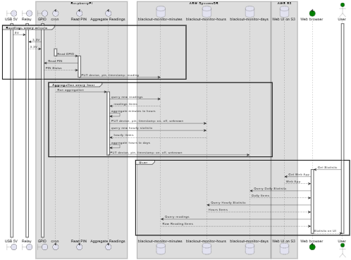
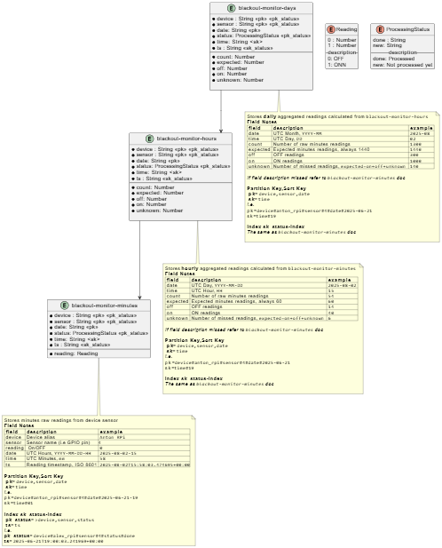

# Blackout Monitor
The project monitors blackouts/


## Hardware 
- Relay (5V Single-Channel Relay Module)
- USB power cable 
- RasberryPi with GPIO (i.e RPi 4)
- DC UPS for RasberryPi
- Internet connection


## Use Case
1. cron triggers GPIO reading every minute. If USB powered - reading is `1` (means `ON`), otherwise `0` (means `OFF`)
2. Reading with device alias, GPIO number and time stamp stored to database
3. cron triggers reading aggregation every hour. It query new readings and re-calculate hourly and daily statistic
4. user getting statistic from aggregated or raw data





## Project structure
- `/buffer` - buffer for readings, first they stored on file system then put to the database
- `/cron_example` - example of `cron` confuguration for readings and aggregation
- `/logs` - reading and aggregation daily logs
- `aggregate.py` - hou rly and daily aggregation 
- `dynamo.py` - dynamodb helper
- `read_pin.py` - read  GPIO
- `utils.py` - logging, buffering and other utils
- `requirements_dev.txt` -  development dependencies
- `requirements.txt` - prod dependencies
- `visualise.ipynb` - Jupiter Notebook test visualization

## Amazon Web Services
The project uses [Amazon DynamoDB](https://aws.amazon.com/dynamodb/) as Cloud Storage of readings.

Amazon DynamoDB is a Serverless, NoSQL, fully managed database with single-digit millisecond performance at any scale.

Key reason of using DynamoDB is a very low price and scalability.

DynamoDB designed as Time series, inspired by [Designing Time-Series Data In DynamoDB](https://dev.to/urielbitton/designing-time-series-data-in-dynamodb-kcj)

To optimize reading need to use `Query` operation rather than `Scan` [Best practices for querying and scanning data in DynamoDB
](https://docs.aws.amazon.com/amazondynamodb/latest/developerguide/bp-query-scan.html)

To use `Query` operation need send queries using equal condition on `Partition` and `Sort` key (`PK` and `SK`).

Thera are two pairs of `PK` and `SK` query by:
-  device and time range (main `PK` and `SK`)
-  device and aggregation status (`PK` and `SK` in index )

Here is example of `PK` and `SK`:

| Table | `pk` (main)| `sk` (main) | `pk_status` (index) | `ts` |
|--|--|--|--|--|
| `blackout-monitor-minutes` | `device#alex_rpi#sensor#4#date#2025-06-21-19` |`time#00` |`device#alex_rpi#sensor#4#status#done` |`2025-06-21T19:00:03.241969+00:00` |
| `blackout-monitor-hours` | `device#alex_rpi#sensor#4#date#2025-06-25` |`time#00` |`device#alex_rpi#sensor#4#status#done` |`2025-06-25T01:05:04.419859+00:00` |
| `blackout-monitor-days` | `device#temp#sensor#4#date#2025-06` |`time#08` |`device#temp#sensor#4#status#new` |`2025-06-11T17:54:21.718067+00:00` |




# Prerequisites 

## Prequisites RPi
1. Setup python 3.10+
2. Setup AWS CLI https://docs.aws.amazon.com/cli/latest/userguide/getting-started-install.html
3. Authorize to AWS CLI `aws configure` https://docs.aws.amazon.com/cli/latest/userguide/cli-authentication-user.html#cli-authentication-user-configure-wizard
4. Setup python venv  `python -m venv ./.venv` https://docs.python.org/3/library/venv.html
5. Setup packages `./.venv/bin/pip install -r requirements.txt`

## GPIO setup on Raspberry 

```
sudo apt-get update
sudo apt-get -y install python3-rpi.gpio
python -m venv ./.venv
.venv/bin/pip install -r ./requirements.txt
```

## Configure cron
Needed to regular read and aggregate readings

1. Add lines to crontab. Specify your user name instead of `pi`  
```
*  *	* * *	pi	cd / && run-parts --report /etc/cron.minutes.pi
05 *	* * *	pi	cd / && run-parts --report /etc/cron.hourly.pi
```
2. Run  (sudo)
```
mkdir -p /etc/cron.hourly.pi/
mkdir -p /etc/cron.minutes.pi/

cp ./cron_example/cron.hourly.pi/aggregate_blackout_readings /etc/cron.hourly.pi/aggregate_blackout_readings

cp ./cron_example/cron.minutes.pi/blackout-monitor /etc/cron.minutes.pi/blackout-monitor

chmod +X  /etc/cron.hourly.pi/aggregate_blackout_readings
chmod +X  /etc/cron.minutes.pi/blackout-monitor
```

3. Edit Cron Scripts `/etc/cron.minutes.pi/blackout-monitor` and `/etc/cron.hourly.pi/aggregate_blackout_readings`
Specify 
- project path (i.e `/home/pi/dev/blackout/`) 
- device name  (i.e. `alex_rpi` )
- GPIO pin to read  (i.e. `4` ), refer to [Raspberry Pi Pinout](https://pinout.xyz/)

4. check `./log` if they work properly


## Development
1. Setup packages `./.venv/bin/pip install -r requirements_dev.txt`
2. Setup key for GitHub [for example](https://docs.github.com/en/authentication/connecting-to-github-with-ssh/generating-a-new-ssh-key-and-adding-it-to-the-ssh-agent?platform=linux)


